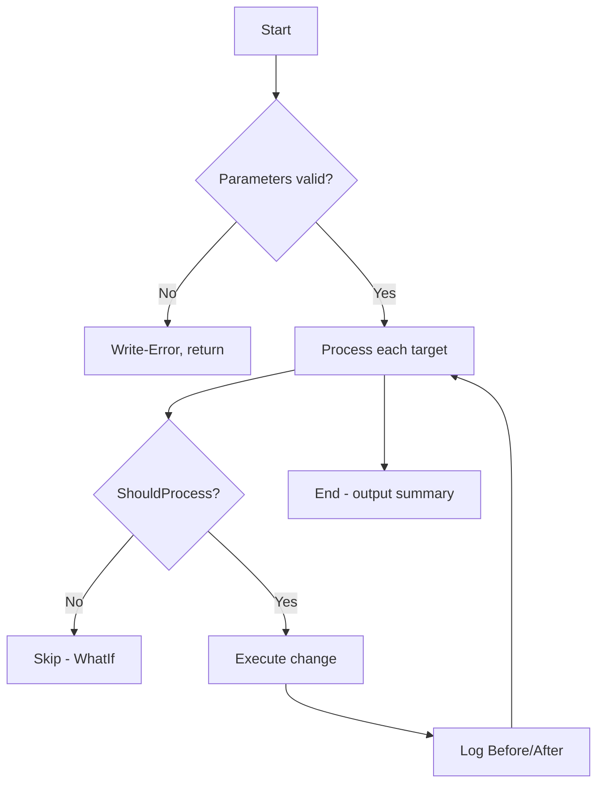
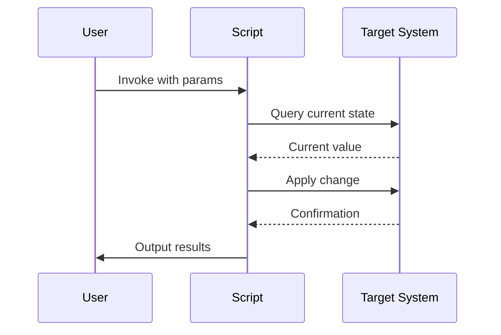

# Skill: New-AdvancedFunction

Scaffold a complete PowerShell advanced function that complies with all workspace steering rules.

## Procedure

1. **Gather requirements** — ask the user for:
   - Function name (must use approved verb from `Get-Verb`)
   - Brief purpose (becomes `.SYNOPSIS`)
   - Parameters (name, type, mandatory?, validation needed?)
   - Does it change state? (determines ShouldProcess, change logging)
   - External module dependencies (for `#Requires`)
   - Pipeline input? (determines `process {}` block usage)

2. **Validate verb** — confirm the verb portion is in `Get-Verb` output. If not, suggest the closest approved verb and confirm with user before proceeding.

3. **Generate the function file** with this structure:

```powershell
#Requires -Modules <ModuleName>  # only if dependencies exist

function Verb-Noun {
    <#
    .SYNOPSIS
        <one-line description>

    .DESCRIPTION
        <expanded description>

    .PARAMETER ParamName
        <param description>

    .EXAMPLE
        Verb-Noun -ParamName 'Value'
        <what this example does>

    .EXAMPLE
        Get-Content servers.txt | Verb-Noun
        <pipeline example if applicable>
    #>
    [CmdletBinding(SupportsShouldProcess)]  # omit SupportsShouldProcess if read-only
    [OutputType([PSCustomObject])]
    param(
        [Parameter(Mandatory, ValueFromPipeline, ValueFromPipelineByPropertyName)]
        [ValidateNotNullOrEmpty()]
        [Alias('CN', 'Name')]
        [string[]]$ComputerName
    )

    begin {
        Set-StrictMode -Version Latest
        $Results = [System.Collections.Generic.List[PSCustomObject]]::new()

        # Change logging setup (only for state-changing functions)
        $LogFile = "$PSScriptRoot\ChangeLog_$(Get-Date -Format 'yyyy-MM-dd_HHmmss').csv"
        $HeaderWritten = $false
        $script:ChangeLog = [System.Collections.Generic.List[PSCustomObject]]::new()
    }

    process {
        foreach ($Computer in $ComputerName) {
            try {
                # --- State-changing pattern ---
                $Before = <current value>
                if ($PSCmdlet.ShouldProcess($Computer, "Set PropertyName from '$Before' to '$NewValue'")) {
                    # perform change
                    $After = <new value>
                    $Record = [PSCustomObject]@{
                        Target    = $Computer
                        Property  = 'PropertyName'
                        Before    = $Before
                        After     = $After
                        Timestamp = Get-Date -Format 'yyyy-MM-dd HH:mm:ss'
                        Status    = if ($After -eq $NewValue) { 'Success' } else { 'Failed' }
                    }
                    $script:ChangeLog.Add($Record)

                    if (-not $HeaderWritten) {
                        $Record | Export-Csv -Path $LogFile -NoTypeInformation -Force
                        $HeaderWritten = $true
                    } else {
                        $Record | Export-Csv -Path $LogFile -NoTypeInformation -Append
                    }
                }

                # --- Read-only pattern ---
                $Result = [PSCustomObject]@{
                    ComputerName = $Computer
                    # properties here
                }
                $Results.Add($Result)
                $Result  # emit to pipeline
            }
            catch {
                $ErrorRecord = $_
                Write-Error "Failed processing '$Computer': $($ErrorRecord.Exception.Message)"
            }
        }
    }

    end {
        Write-Verbose "Processed $($Results.Count) items"
    }
}
```

4. **Trim unused patterns** — remove the state-changing block if read-only, remove pipeline params if not needed, remove change logging if function is a getter.

5. **Create companion documentation** at `docs/Verb-Noun.md` with:

````markdown
# Verb-Noun

## Purpose
<synopsis>

## Flowchart



## Sequence Diagram


````

6. **Final checks:**
   - Verify no aliases used (full cmdlet names only)
   - Verify no positional parameters used
   - Verify all parameters have validation attributes
   - Confirm `[OutputType()]` matches actual output
   - Confirm examples use RFC 5737 IPs and `example.com` domains
