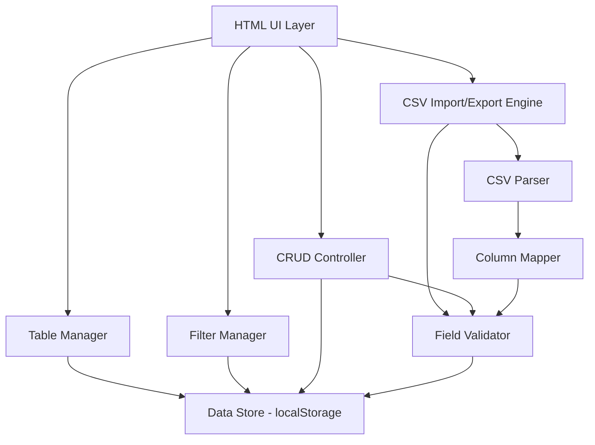
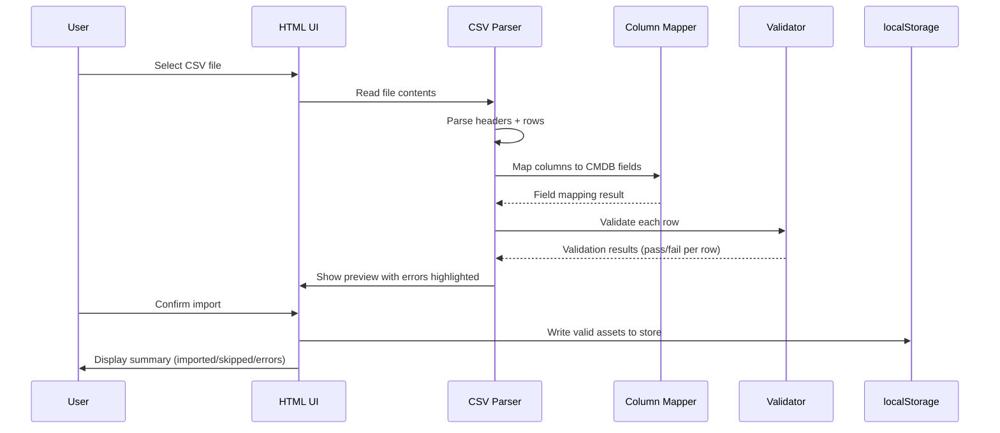
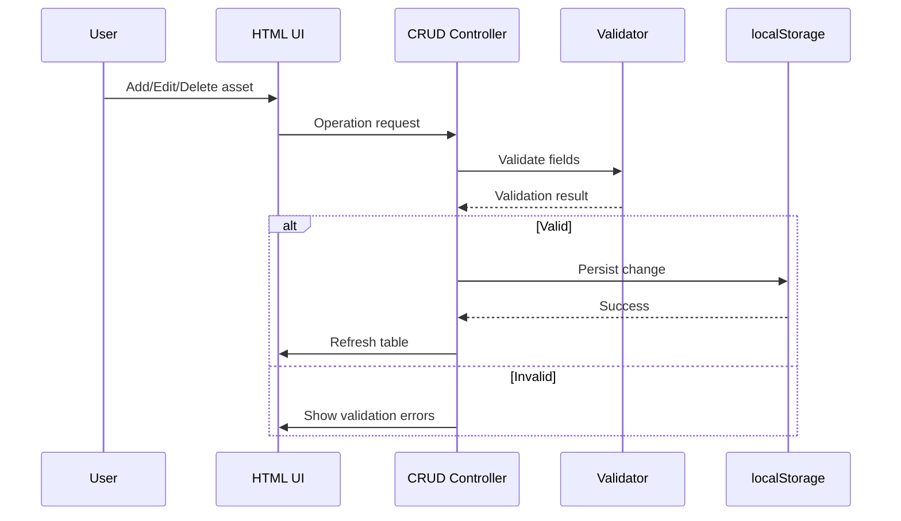

# Design Document: Asset Inventory System

## Overview

A self-contained HTML/JavaScript web application providing a multi-purpose CMDB-style asset inventory. The system runs entirely client-side (single HTML file with embedded JS/CSS) — no backend server required. Assets are stored in browser localStorage with full CRUD operations, CSV bulk import/export, and flexible filtering.

The inventory supports multiple asset types (servers, network devices, storage, applications) with CMDB-standard fields aligned to the Windows/VMware infrastructure management context: hostname, IP address, OS, environment, location, owner, status, and extensible custom fields. CSV upload enables bulk population from existing tools like RVTools exports, AD queries, or vCenter inventory scripts.

This design prioritizes simplicity and portability — a single HTML file that any team member can open in a browser without dependencies, deployments, or authentication overhead.

## Architecture



## Sequence Diagrams

### CSV Bulk Import Flow



### CRUD Operations Flow



## Components and Interfaces

### Component 1: Data Store

**Purpose**: Manages persistence of asset records in browser localStorage with JSON serialization.

**Interface**:
```javascript
const DataStore = {
  getAll()                    // Returns: Asset[]
  getById(id)                 // Returns: Asset | null
  save(asset)                 // Returns: Asset (with generated id if new)
  delete(id)                  // Returns: boolean
  bulkImport(assets)          // Returns: { imported: number, errors: Error[] }
  exportAll()                 // Returns: Asset[]
  clear()                     // Returns: void
  getStats()                  // Returns: { total, byType, byStatus, byEnv }
}
```

**Responsibilities**:
- Serialize/deserialize assets to/from localStorage
- Generate unique IDs (UUID v4) for new assets
- Maintain data integrity on bulk operations
- Provide aggregate statistics

### Component 2: CSV Parser

**Purpose**: Parses CSV text into structured rows, handling quoted fields, commas in values, and various line endings.

**Interface**:
```javascript
const CsvParser = {
  parse(csvText)              // Returns: { headers: string[], rows: string[][] }
  detectDelimiter(csvText)    // Returns: ',' | ';' | '\t'
  stringify(assets, fields)   // Returns: string (CSV text)
}
```

**Responsibilities**:
- Parse RFC 4180 compliant CSV
- Auto-detect delimiter (comma, semicolon, tab)
- Handle quoted fields with embedded commas/newlines
- Generate CSV output for export

### Component 3: Column Mapper

**Purpose**: Maps CSV column headers to internal CMDB field names using fuzzy matching and alias tables.

**Interface**:
```javascript
const ColumnMapper = {
  mapHeaders(csvHeaders)      // Returns: { mapped: {csvCol: fieldName}, unmapped: string[] }
  getAliases()                // Returns: { fieldName: string[] } (known aliases per field)
  addAlias(fieldName, alias)  // Returns: void
}
```

**Responsibilities**:
- Match CSV headers to CMDB fields (case-insensitive)
- Support common aliases (e.g., "Server Name" → hostname, "IP Address" → ipAddress)
- Identify unmapped columns for user review
- Support RVTools, AD export, and vCenter export column naming conventions

### Component 4: Field Validator

**Purpose**: Validates asset field values against type rules, format patterns, and allowed values.

**Interface**:
```javascript
const FieldValidator = {
  validate(asset)             // Returns: { valid: boolean, errors: FieldError[] }
  validateField(name, value)  // Returns: { valid: boolean, error?: string }
  getFieldDefs()              // Returns: FieldDefinition[]
}
```

**Responsibilities**:
- Validate IP address format (IPv4)
- Validate hostname conventions
- Enforce required fields
- Check enum values (status, environment, assetType)
- Return specific error messages per field

### Component 5: Filter Manager

**Purpose**: Manages multi-column filtering, search, and sort state for the asset table.

**Interface**:
```javascript
const FilterManager = {
  apply(assets, filters)      // Returns: Asset[]
  search(assets, query)       // Returns: Asset[] (full-text across all fields)
  sort(assets, field, dir)    // Returns: Asset[]
  getActiveFilters()          // Returns: Filter[]
}
```

**Responsibilities**:
- Multi-field filtering (AND logic)
- Free-text search across all fields
- Column sorting (asc/desc)
- Maintain filter state for UI binding

### Component 6: Table Manager

**Purpose**: Renders asset data into the HTML table with pagination, inline editing, and row selection.

**Interface**:
```javascript
const TableManager = {
  render(assets, page, pageSize)  // Returns: void (updates DOM)
  setPage(pageNum)                // Returns: void
  setPageSize(size)               // Returns: void
  getSelectedIds()                // Returns: string[]
  refresh()                       // Returns: void
}
```

**Responsibilities**:
- Render paginated table rows
- Handle row selection (single + multi-select)
- Trigger column sort on header click
- Display field validation state inline
- Support configurable visible columns

### Component 7: CRUD Controller

**Purpose**: Orchestrates create/read/update/delete operations between UI forms and the data store.

**Interface**:
```javascript
const CrudController = {
  create(formData)            // Returns: { success: boolean, asset?: Asset, errors?: FieldError[] }
  update(id, formData)        // Returns: { success: boolean, asset?: Asset, errors?: FieldError[] }
  delete(ids)                 // Returns: { deleted: number }
  duplicate(id)               // Returns: Asset
}
```

**Responsibilities**:
- Validate before persist
- Coordinate UI refresh after mutations
- Support bulk delete
- Duplicate existing asset as template

## Data Models

### Asset (Core Record)

```javascript
/**
 * @typedef {Object} Asset
 * @property {string} id              - UUID v4, auto-generated
 * @property {string} hostname        - Primary identifier (e.g., "P01APWSQL01")
 * @property {string} ipAddress       - IPv4 address
 * @property {string} os              - Operating system (e.g., "Windows Server 2019")
 * @property {string} environment     - Deployment environment
 * @property {string} location        - Physical/logical location
 * @property {string} owner           - Responsible team or individual
 * @property {string} status          - Lifecycle status
 * @property {string} assetType       - Category of asset
 * @property {string} [description]   - Free-text notes
 * @property {string} [cluster]       - vSphere cluster or logical group
 * @property {string} [datacenter]    - Datacenter name
 * @property {number} [cpuCount]      - Number of vCPUs
 * @property {number} [memoryGB]      - RAM in GB
 * @property {number} [storageGB]     - Total provisioned storage in GB
 * @property {string} [application]   - Associated application/service
 * @property {string} [businessUnit]  - Owning business unit
 * @property {Object} [customFields]  - Extensible key-value pairs
 * @property {string} createdAt       - ISO 8601 timestamp
 * @property {string} updatedAt       - ISO 8601 timestamp
 */
```

**Validation Rules**:
- `hostname`: Required. 1-63 chars, alphanumeric + hyphens, no leading/trailing hyphen
- `ipAddress`: Optional. Valid IPv4 format (regex: `^\d{1,3}\.\d{1,3}\.\d{1,3}\.\d{1,3}$` with octet range 0-255)
- `os`: Optional. Free text
- `environment`: Required. One of: `Production`, `Staging`, `Development`, `Test`, `DR`, `Lab`, `Decommissioned`
- `status`: Required. One of: `Active`, `Inactive`, `Provisioning`, `Maintenance`, `Decommissioning`, `Retired`
- `assetType`: Required. One of: `Server`, `Virtual Machine`, `Network Device`, `Storage`, `Application`, `Database`, `Other`
- `location`: Optional. Free text
- `owner`: Optional. Free text
- `cpuCount`: Optional. Positive integer
- `memoryGB`: Optional. Positive number
- `storageGB`: Optional. Positive number

### Enum Definitions

```javascript
const ENVIRONMENTS = [
  'Production', 'Staging', 'Development', 'Test', 'DR', 'Lab', 'Decommissioned'
];

const STATUSES = [
  'Active', 'Inactive', 'Provisioning', 'Maintenance', 'Decommissioning', 'Retired'
];

const ASSET_TYPES = [
  'Server', 'Virtual Machine', 'Network Device', 'Storage',
  'Application', 'Database', 'Other'
];
```

### Column Alias Map (CSV Import)

```javascript
const COLUMN_ALIASES = {
  hostname:    ['hostname', 'server name', 'servername', 'name', 'vm name', 'vmname', 'host', 'computer', 'computername', 'dns name'],
  ipAddress:   ['ip address', 'ipaddress', 'ip', 'primary ip', 'ipv4', 'ip_address', 'primaryipaddress'],
  os:          ['os', 'operating system', 'operatingsystem', 'os version', 'osname', 'guest os'],
  environment: ['environment', 'env', 'tier', 'stage'],
  location:    ['location', 'site', 'datacenter', 'data center', 'dc', 'facility'],
  owner:       ['owner', 'owned by', 'team', 'contact', 'responsible'],
  status:      ['status', 'state', 'lifecycle', 'power state', 'powerstate'],
  assetType:   ['type', 'asset type', 'category', 'class', 'ci type'],
  cluster:     ['cluster', 'vmware cluster', 'esxi cluster'],
  datacenter:  ['datacenter', 'data center', 'vcenter', 'dc'],
  cpuCount:    ['cpu', 'cpus', 'vcpu', 'vcpus', 'num cpu', 'cores', 'cpu count'],
  memoryGB:    ['memory', 'ram', 'memory gb', 'memorygb', 'mem', 'memory_gb'],
  storageGB:   ['storage', 'disk', 'storage gb', 'provisioned storage', 'total disk', 'disk_gb'],
  application: ['application', 'app', 'service', 'application name'],
  businessUnit:['business unit', 'bu', 'department', 'dept', 'org']
};
```

## Algorithmic Pseudocode

### CSV Import Algorithm

```javascript
/**
 * ALGORITHM: importCsvToInventory
 * INPUT: csvText (string) - raw CSV file contents
 * OUTPUT: ImportResult { imported, skipped, errors[] }
 *
 * PRECONDITIONS:
 *   - csvText is non-empty string
 *   - csvText contains at least a header row
 *
 * POSTCONDITIONS:
 *   - All valid rows are persisted to DataStore
 *   - Invalid rows are reported with row number and error details
 *   - Existing assets with matching hostname are updated (upsert behavior)
 *   - DataStore state is consistent (no partial writes)
 */
function importCsv(csvText) {
    const result = { imported: 0, skipped: 0, errors: [] };

    // Step 1: Parse CSV text into structured data
    const { headers, rows } = CsvParser.parse(csvText);
    if (headers.length === 0) return { ...result, errors: ['No headers found'] };

    // Step 2: Map CSV columns to CMDB fields
    const { mapped, unmapped } = ColumnMapper.mapHeaders(headers);
    if (Object.keys(mapped).length === 0) {
        return { ...result, errors: ['No columns could be mapped to known fields'] };
    }

    // Step 3: Transform and validate each row
    const validAssets = [];
    for (let i = 0; i < rows.length; i++) {
        const rowData = buildAssetFromRow(rows[i], headers, mapped);
        const validation = FieldValidator.validate(rowData);

        if (validation.valid) {
            validAssets.push(rowData);
        } else {
            result.errors.push({ row: i + 2, fields: validation.errors });
            result.skipped++;
        }
    }

    // Step 4: Bulk persist valid assets (upsert by hostname)
    const bulkResult = DataStore.bulkImport(validAssets);
    result.imported = bulkResult.imported;

    return result;
}
```

### Field Validation Algorithm

```javascript
/**
 * ALGORITHM: validateAsset
 * INPUT: asset (Object) - asset record to validate
 * OUTPUT: ValidationResult { valid: boolean, errors: FieldError[] }
 *
 * PRECONDITIONS:
 *   - asset is a non-null object
 *
 * POSTCONDITIONS:
 *   - Returns valid=true iff all required fields present AND all fields pass format checks
 *   - errors array contains one entry per failing field
 *   - No side effects on input asset
 */
function validateAsset(asset) {
    const errors = [];
    const REQUIRED = ['hostname', 'environment', 'status', 'assetType'];

    // Check required fields
    for (const field of REQUIRED) {
        if (!asset[field] || asset[field].trim() === '') {
            errors.push({ field, message: `${field} is required` });
        }
    }

    // Hostname format: 1-63 chars, alphanumeric + hyphens, no leading/trailing hyphen
    if (asset.hostname && !/^[a-zA-Z0-9]([a-zA-Z0-9\-]{0,61}[a-zA-Z0-9])?$/.test(asset.hostname)) {
        errors.push({ field: 'hostname', message: 'Invalid hostname format' });
    }

    // IP address format (if provided)
    if (asset.ipAddress && !isValidIPv4(asset.ipAddress)) {
        errors.push({ field: 'ipAddress', message: 'Invalid IPv4 address' });
    }

    // Enum validation
    if (asset.environment && !ENVIRONMENTS.includes(asset.environment)) {
        errors.push({ field: 'environment', message: `Must be one of: ${ENVIRONMENTS.join(', ')}` });
    }
    if (asset.status && !STATUSES.includes(asset.status)) {
        errors.push({ field: 'status', message: `Must be one of: ${STATUSES.join(', ')}` });
    }
    if (asset.assetType && !ASSET_TYPES.includes(asset.assetType)) {
        errors.push({ field: 'assetType', message: `Must be one of: ${ASSET_TYPES.join(', ')}` });
    }

    // Numeric fields
    if (asset.cpuCount !== undefined && (isNaN(asset.cpuCount) || asset.cpuCount < 1)) {
        errors.push({ field: 'cpuCount', message: 'Must be a positive integer' });
    }
    if (asset.memoryGB !== undefined && (isNaN(asset.memoryGB) || asset.memoryGB <= 0)) {
        errors.push({ field: 'memoryGB', message: 'Must be a positive number' });
    }

    return { valid: errors.length === 0, errors };
}
```

### Column Mapping Algorithm

```javascript
/**
 * ALGORITHM: mapHeaders
 * INPUT: csvHeaders (string[]) - raw header names from CSV first row
 * OUTPUT: MappingResult { mapped: {csvIndex: fieldName}, unmapped: string[] }
 *
 * PRECONDITIONS:
 *   - csvHeaders is non-empty array of strings
 *   - COLUMN_ALIASES is populated with known aliases
 *
 * POSTCONDITIONS:
 *   - Each CSV header maps to at most one CMDB field
 *   - Each CMDB field maps to at most one CSV column (first match wins)
 *   - Unmapped headers are reported for user review
 *   - Matching is case-insensitive and trim-normalized
 *
 * LOOP INVARIANT:
 *   - After processing header[i], all headers[0..i] are classified as mapped or unmapped
 *   - No CMDB field has more than one mapping
 */
function mapHeaders(csvHeaders) {
    const mapped = {};
    const usedFields = new Set();
    const unmapped = [];

    for (let i = 0; i < csvHeaders.length; i++) {
        const normalized = csvHeaders[i].trim().toLowerCase();
        let matched = false;

        for (const [fieldName, aliases] of Object.entries(COLUMN_ALIASES)) {
            if (usedFields.has(fieldName)) continue;

            if (aliases.includes(normalized)) {
                mapped[i] = fieldName;
                usedFields.add(fieldName);
                matched = true;
                break;
            }
        }

        if (!matched) {
            unmapped.push(csvHeaders[i]);
        }
    }

    return { mapped, unmapped };
}
```

### Filter and Search Algorithm

```javascript
/**
 * ALGORITHM: applyFiltersAndSearch
 * INPUT: assets (Asset[]), filters (Filter[]), searchQuery (string)
 * OUTPUT: Asset[] - filtered and matched subset
 *
 * PRECONDITIONS:
 *   - assets is a valid array (may be empty)
 *   - filters is array of { field, value } objects
 *   - searchQuery is a string (may be empty)
 *
 * POSTCONDITIONS:
 *   - Result contains only assets matching ALL active filters (AND logic)
 *   - If searchQuery non-empty, result further filtered to assets containing query
 *   - Original array is not mutated
 *   - Empty filters + empty query returns all assets
 */
function applyFiltersAndSearch(assets, filters, searchQuery) {
    let result = assets;

    // Apply column filters (AND logic)
    for (const filter of filters) {
        result = result.filter(asset =>
            String(asset[filter.field] || '').toLowerCase()
                .includes(filter.value.toLowerCase())
        );
    }

    // Apply full-text search across all string fields
    if (searchQuery && searchQuery.trim()) {
        const query = searchQuery.trim().toLowerCase();
        result = result.filter(asset =>
            Object.values(asset).some(val =>
                String(val).toLowerCase().includes(query)
            )
        );
    }

    return result;
}
```

## Key Functions with Formal Specifications

### Function: isValidIPv4(ip)

```javascript
function isValidIPv4(ip) {
    const parts = ip.split('.');
    if (parts.length !== 4) return false;
    return parts.every(p => {
        const num = parseInt(p, 10);
        return !isNaN(num) && num >= 0 && num <= 255 && String(num) === p;
    });
}
```

**Preconditions:**
- `ip` is a non-null string

**Postconditions:**
- Returns `true` iff ip matches format `A.B.C.D` where A-D are integers 0-255 with no leading zeros
- No side effects

### Function: generateId()

```javascript
function generateId() {
    return 'xxxxxxxx-xxxx-4xxx-yxxx-xxxxxxxxxxxx'.replace(/[xy]/g, c => {
        const r = Math.random() * 16 | 0;
        return (c === 'x' ? r : (r & 0x3 | 0x8)).toString(16);
    });
}
```

**Preconditions:** None

**Postconditions:**
- Returns a valid UUID v4 string
- Each call produces a unique value (probabilistically)

### Function: buildAssetFromRow(row, headers, mapping)

```javascript
function buildAssetFromRow(row, headers, mapping) {
    const asset = {
        id: generateId(),
        createdAt: new Date().toISOString(),
        updatedAt: new Date().toISOString()
    };

    for (const [colIndex, fieldName] of Object.entries(mapping)) {
        const value = row[colIndex] ? row[colIndex].trim() : '';
        if (value) {
            // Coerce numeric fields
            if (['cpuCount', 'memoryGB', 'storageGB'].includes(fieldName)) {
                asset[fieldName] = parseFloat(value);
            } else {
                asset[fieldName] = value;
            }
        }
    }

    return asset;
}
```

**Preconditions:**
- `row` is a string array matching headers length
- `headers` is the original CSV header array
- `mapping` is a valid output from `mapHeaders()`

**Postconditions:**
- Returns an Asset object with mapped fields populated
- Numeric fields are coerced to numbers
- Empty/whitespace values are skipped
- `id`, `createdAt`, `updatedAt` are always set

**Loop Invariant:**
- After processing mapping entry `i`, all fields for columns 0..i are populated in asset

### Function: DataStore.bulkImport(assets)

```javascript
function bulkImport(assets) {
    const existing = getAll();
    const hostnameIndex = new Map(existing.map(a => [a.hostname.toLowerCase(), a]));
    let imported = 0;
    const errors = [];

    for (const asset of assets) {
        try {
            const key = asset.hostname.toLowerCase();
            if (hostnameIndex.has(key)) {
                // Upsert: merge new data into existing record
                const existing = hostnameIndex.get(key);
                Object.assign(existing, asset, {
                    id: existing.id,
                    createdAt: existing.createdAt,
                    updatedAt: new Date().toISOString()
                });
            } else {
                // Insert new
                existing.push(asset);
                hostnameIndex.set(key, asset);
            }
            imported++;
        } catch (e) {
            errors.push({ hostname: asset.hostname, error: e.message });
        }
    }

    // Atomic write
    localStorage.setItem('inventory_assets', JSON.stringify(existing));
    return { imported, errors };
}
```

**Preconditions:**
- `assets` is an array of validated Asset objects
- Each asset has a non-empty `hostname`
- localStorage is available and writable

**Postconditions:**
- All assets are persisted (insert or update)
- Existing assets with same hostname retain their original `id` and `createdAt`
- `updatedAt` is refreshed on upserted records
- Single atomic write to localStorage

**Loop Invariant:**
- After processing asset[i], `hostnameIndex` contains all assets processed so far
- `imported` count equals number of successfully processed assets

## Example Usage

```javascript
// Example 1: Import CSV from file input
document.getElementById('csvFile').addEventListener('change', async (e) => {
    const file = e.target.files[0];
    const text = await file.text();
    const result = importCsv(text);
    
    showNotification(`Imported ${result.imported} assets, ${result.skipped} skipped`);
    if (result.errors.length > 0) {
        showErrorPanel(result.errors);
    }
    TableManager.refresh();
});

// Example 2: Create asset manually
const newAsset = CrudController.create({
    hostname: 'P01APWWEB03',
    ipAddress: '10.20.30.40',
    os: 'Windows Server 2019',
    environment: 'Production',
    status: 'Active',
    assetType: 'Virtual Machine',
    owner: 'Web Platform Team',
    cluster: 'PROD-WEB-01'
});

// Example 3: Filter and search
const filters = [
    { field: 'environment', value: 'Production' },
    { field: 'status', value: 'Active' }
];
const results = FilterManager.apply(DataStore.getAll(), filters);
const searched = FilterManager.search(results, 'SQL');
TableManager.render(searched, 1, 50);

// Example 4: Export to CSV
const csvText = CsvParser.stringify(DataStore.exportAll(), Object.keys(COLUMN_ALIASES));
const blob = new Blob([csvText], { type: 'text/csv' });
const url = URL.createObjectURL(blob);
// Trigger download...
```

## Correctness Properties

*A property is a characteristic or behavior that should hold true across all valid executions of a system — essentially, a formal statement about what the system should do. Properties serve as the bridge between human-readable specifications and machine-verifiable correctness guarantees.*

### Property 1: CSV Round-Trip Integrity

*For any* valid set of assets, exporting them to CSV via CsvParser.stringify and then importing that CSV via CsvParser.parse and the import pipeline SHALL produce an equivalent set of assets with matching field values (modulo ordering and auto-generated metadata like id and timestamps).

**Validates: Requirements 3.1, 3.5, 11.1, 11.2**

### Property 2: Import Idempotency

*For any* valid CSV file, importing it twice in succession SHALL result in the DataStore containing the same number of assets as after the first import — the second import updates existing records without creating duplicates.

**Validates: Requirements 5.6, 5.3**

### Property 3: Upsert Identity Preservation

*For any* existing asset in the DataStore, when a CSV import contains a row with a matching hostname (case-insensitive), the DataStore SHALL update that record while preserving the original id and createdAt timestamp.

**Validates: Requirements 5.3, 1.5**

### Property 4: Validation Completeness

*For any* asset stored in the DataStore, calling FieldValidator.validate on that asset SHALL return valid=true. No invalid asset can enter the store through any code path (CRUD or import).

**Validates: Requirements 2.8, 5.1, 6.2**

### Property 5: Hostname Validation

*For any* string input, the Field_Validator SHALL accept it as a valid hostname if and only if it is 1-63 characters long, contains only alphanumeric characters and hyphens, and does not start or end with a hyphen.

**Validates: Requirement 2.1**

### Property 6: IPv4 Validation

*For any* string input, the Field_Validator SHALL accept it as a valid IPv4 address if and only if it consists of exactly four dot-separated decimal octets each in range 0-255 with no leading zeros.

**Validates: Requirement 2.2**

### Property 7: Enum Validation

*For any* string input and any enum field (environment, status, assetType), the Field_Validator SHALL accept the value if and only if it exactly matches one of the predefined allowed values for that field.

**Validates: Requirements 2.3, 2.4, 2.5**

### Property 8: ID Uniqueness Invariant

*For any* state of the DataStore, all asset IDs SHALL be distinct — no two assets share the same id value.

**Validates: Requirements 9.3, 1.3**

### Property 9: Hostname Uniqueness Invariant

*For any* state of the DataStore, all asset hostnames (compared case-insensitively) SHALL be distinct — no two assets share the same hostname.

**Validates: Requirement 9.4**

### Property 10: Filter Subset and AND Logic

*For any* set of assets and any combination of column filters, the filtered result SHALL be a subset of the input where every returned asset matches ALL active filters (AND logic) using case-insensitive comparison.

**Validates: Requirements 7.1, 7.5**

### Property 11: Search Containment

*For any* set of assets and any search query string, every asset in the search results SHALL contain the query string (case-insensitive) in at least one of its field values.

**Validates: Requirements 7.2, 7.5**

### Property 12: Filter-Then-Search Composition

*For any* set of assets, column filters, and search query, applying filters then searching within results SHALL produce a result that is a subset of applying filters alone.

**Validates: Requirement 7.3**

### Property 13: Sort Ordering

*For any* set of assets and any sort field/direction, the sorted result SHALL maintain the correct ordering invariant — each consecutive pair of elements satisfies the comparison for the specified direction.

**Validates: Requirement 7.6**

### Property 14: Pagination Completeness

*For any* set of assets and any page size, the union of all pages SHALL equal the complete dataset with no duplicates and no omissions.

**Validates: Requirement 8.2**

### Property 15: Delete Consistency

*For any* asset in the DataStore, after deletion that asset SHALL not be retrievable by ID, and all other assets SHALL remain unaffected.

**Validates: Requirement 6.4**

### Property 16: Timestamp Monotonicity

*For any* asset in the DataStore, the updatedAt timestamp SHALL always be greater than or equal to the createdAt timestamp.

**Validates: Requirements 1.5, 6.3**

### Property 17: localStorage Serialization Round-Trip

*For any* set of valid assets, serializing to JSON and storing in localStorage then deserializing SHALL produce equivalent Asset objects with all field values preserved.

**Validates: Requirements 9.1, 9.2**

### Property 18: Formula Injection Protection

*For any* asset field value that begins with =, +, -, or @, the CSV export SHALL prefix that value with a single quote character in the output.

**Validates: Requirement 10.2**

### Property 19: HTML Tag Stripping on Import

*For any* CSV field value containing HTML tags, after import the stored value SHALL contain no HTML tag characters — all tags are stripped before persistence.

**Validates: Requirement 12.2**

### Property 20: Column Mapping Case Insensitivity

*For any* known alias string in any case variation (uppercase, lowercase, mixed), the Column_Mapper SHALL correctly map it to the corresponding CMDB field name.

**Validates: Requirement 4.1**

### Property 21: Column Mapping First-Match Priority

*For any* set of CSV headers containing multiple aliases that map to the same CMDB field, the Column_Mapper SHALL map only the first occurrence and report subsequent duplicates as unmapped.

**Validates: Requirement 4.3**

## Error Handling

### Error Scenario 1: Invalid CSV Format

**Condition**: Uploaded file is not valid CSV (binary, corrupted, or empty)
**Response**: Display error banner: "Unable to parse file. Please ensure it's a valid CSV."
**Recovery**: User selects a different file. No data modified.

### Error Scenario 2: No Mappable Columns

**Condition**: CSV headers don't match any known CMDB field aliases
**Response**: Show column mapping UI allowing manual assignment of CSV columns to fields
**Recovery**: User manually maps columns or cancels import

### Error Scenario 3: Partial Validation Failures

**Condition**: Some CSV rows pass validation, others fail
**Response**: Show preview table with valid rows (green) and invalid rows (red with error tooltips). User chooses to import valid-only or cancel.
**Recovery**: Valid rows imported; invalid rows listed in error summary for correction

### Error Scenario 4: localStorage Quota Exceeded

**Condition**: Bulk import exceeds browser's ~5-10MB localStorage limit
**Response**: Display error: "Storage limit reached. Consider exporting and archiving old records."
**Recovery**: User exports/deletes old assets, then retries import

### Error Scenario 5: Duplicate Hostname Conflict

**Condition**: Import contains asset with hostname already in store
**Response**: Upsert behavior — existing record updated with new values, preserving original ID and createdAt
**Recovery**: Automatic (by design). Change log shows "updated" vs "created" counts.

## Testing Strategy

### Unit Testing Approach

Key test cases:
- CSV parser handles quoted fields, embedded commas, CRLF/LF line endings
- Column mapper matches all known aliases (case-insensitive)
- Field validator correctly accepts/rejects each field type
- IP validation covers edge cases (0.0.0.0, 255.255.255.255, leading zeros)
- Hostname validation catches invalid chars, length violations
- Filter logic handles empty filters, single filter, multiple filters
- Sort handles numeric vs string comparison correctly
- Pagination boundary: first page, last page, single-item page

### Property-Based Testing Approach

**Property Test Library**: fast-check (JavaScript)

Properties to test:
- **CSV roundtrip**: For any array of valid assets, `parse(stringify(assets))` recovers original data
- **Filter monotonicity**: Adding a filter never increases result count
- **Sort stability**: Sorting by field X preserves relative order of items with equal X values
- **Validation determinism**: `validate(asset)` always returns same result for same input
- **ID uniqueness**: Generating N IDs produces N distinct values (probabilistic)

### Integration Testing Approach

- Full workflow: Create CSV → Upload → Verify table shows correct data
- Edit an imported asset → Verify localStorage updated
- Filter imported data → Verify correct subset shown
- Export filtered view → Verify CSV matches displayed data
- Bulk delete → Verify removed from store and table

## Performance Considerations

- **localStorage limit**: ~5-10MB depending on browser. Approximately 10,000-20,000 assets fit comfortably.
- **Table rendering**: Pagination prevents DOM overload. Default 50 rows per page. Virtual scrolling not needed under 20K assets.
- **Search performance**: Linear scan is acceptable for <20K records. If performance becomes an issue, pre-build a simple inverted index on localStorage write.
- **CSV parsing**: For files >1MB, parse in chunks using string splitting rather than regex-based full parse.
- **Filter debounce**: 250ms debounce on search input to prevent excessive re-rendering.

## Security Considerations

- **Data locality**: All data stays in browser localStorage. No network transmission.
- **XSS prevention**: All user-supplied values rendered via `textContent` (not `innerHTML`). CSV field values are escaped before display.
- **Input sanitization**: Strip HTML tags from imported CSV fields.
- **No authentication**: Single-user local tool. If multi-user needed in future, would require server backend.
- **Export safety**: CSV export uses proper quoting to prevent formula injection (prefix `=`, `+`, `-`, `@` with single quote).

## Dependencies

- **None (external)**: Single self-contained HTML file with embedded CSS and JavaScript
- **Browser APIs used**: localStorage, FileReader API, Blob API, URL.createObjectURL
- **Minimum browser**: Modern browsers with ES6+ support (Chrome 60+, Firefox 55+, Edge 79+)
- **Optional integration**: Designed to accept CSV exports from:
  - RVTools (VM inventory exports)
  - PowerShell `Export-Csv` output (AD, vCenter queries)
  - ServiceNow CMDB exports
  - Excel save-as-CSV
