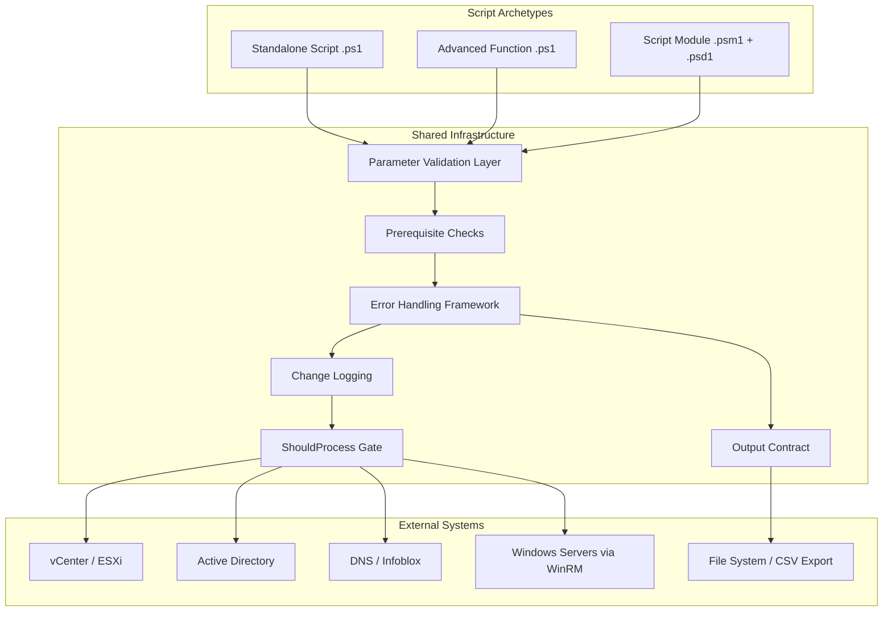
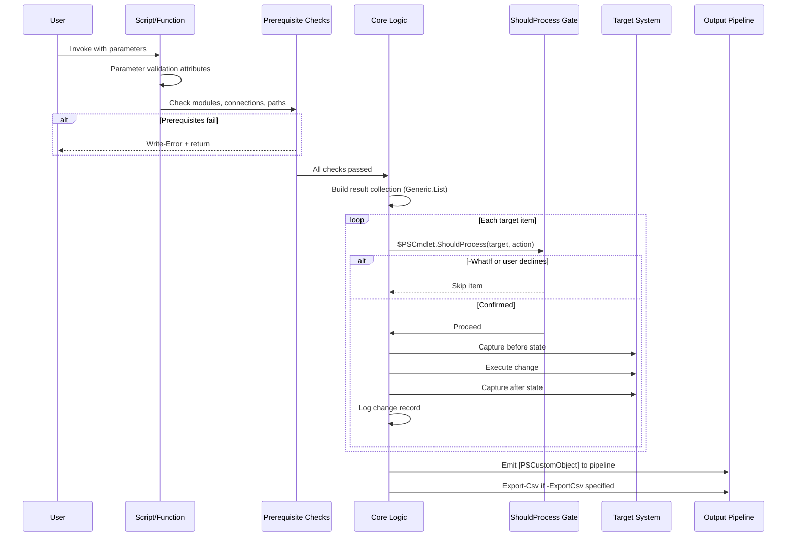

# Design Document: PowerShell Development Standards

## Overview

This design defines the standard architecture, patterns, and correctness properties for all PowerShell scripts, advanced functions, and modules developed in this workspace. It covers three script archetypes (standalone scripts, advanced functions, and script modules) and establishes enforceable contracts for parameter design, state management, output formatting, error handling, documentation, and testing.

The design targets PowerShell 7 + on Windows, automating VMware vSphere, Active Directory, DNS/Infoblox, SCCM, and Windows Server infrastructure. All patterns prioritize pipeline-first composability, fail-fast validation, idempotent operations, and auditable state changes.

## Architecture



## Component Architecture: Script Lifecycle



## Components and Interfaces

### Component 1: Script Structure Template

**Purpose**: Defines the canonical file structure for all script types.

**Interface — Standalone Script**:
```powershell
#Requires -Modules ModuleName
#Requires -Version 5.1

<#
    .SYNOPSIS
        Brief description of what this script does.

    .DESCRIPTION
        Detailed description of behavior, prerequisites, and output.

    .PARAMETER ParameterName
        Description of parameter.

    .EXAMPLE
        .\Verb-Noun.ps1 -ParameterName 'value'

        Description of example.

    .NOTES
        Prerequisites: Active vCenter connection, etc.
#>

[CmdletBinding(SupportsShouldProcess)]
param (
    [Parameter(Mandatory, ValueFromPipeline, Position = 0)]
    [ValidateNotNullOrEmpty()]
    [Alias('CN', 'Name')]
    [string[]]$ComputerName,

    [Parameter(HelpMessage = "Path to export CSV")]
    [string]$ExportCsv
)

Set-StrictMode -Version Latest

# Prerequisite checks
# Core logic
# Output
```

**Interface — Advanced Function**:
```powershell
function Verb-Noun {
    <#
        .SYNOPSIS
        .DESCRIPTION
        .PARAMETER
        .EXAMPLE
        .NOTES
    #>
    [CmdletBinding(SupportsShouldProcess, DefaultParameterSetName = 'Default')]
    [OutputType([PSCustomObject])]
    param ( ... )

    begin {
        Set-StrictMode -Version Latest
        # Connection validation
        # Initialize collections
    }

    process {
        # Per-item logic, pipeline streaming
    }

    end {
        # Export, cleanup, return collection
    }
}
```

**Responsibilities**:
- Enforce consistent file layout across all scripts
- Ensure `#Requires` statements load-time gate dependencies
- Place comment-based help inside functions (not above)
- Guarantee `[CmdletBinding()]` on all public entry points

### Component 2: Parameter Validation Layer

**Purpose**: Ensures all input is validated declaratively before function body executes.

**Interface**:
```powershell
param (
    [Parameter(Mandatory, ValueFromPipeline, Position = 0,
        HelpMessage = "Target computer name(s)")]
    [ValidateNotNullOrEmpty()]
    [Alias('CN', 'Name', 'Server')]
    [string[]]$ComputerName,

    [Parameter(Mandatory, ParameterSetName = 'ByCluster')]
    [ValidateNotNullOrEmpty()]
    [string]$Cluster,

    [Parameter()]
    [ValidateRange(1, 120)]
    [int]$TimeoutMinutes = 15,

    [Parameter()]
    [ValidateSet('Running', 'Stopped', 'Maintenance')]
    [string]$State = 'Running',

    [Parameter()]
    [ValidateScript({ Test-Path $_ -PathType Leaf })]
    [string]$InputFile,

    [Parameter()]
    [System.Management.Automation.PSCredential]
    [System.Management.Automation.Credential()]
    $Credential = [System.Management.Automation.PSCredential]::Empty
)
```

**Responsibilities**:
- PascalCase parameter names matching PowerShell conventions
- Validation attributes replace manual if-then checks
- `[Alias()]` for discoverability and backward compatibility
- `[PSCredential]` with `[Credential()]` transform for credential parameters
- `[OutputType()]` declared on all functions returning objects
- ParameterSetName with DefaultParameterSetName for mutually exclusive params

### Component 3: Prerequisite Check Framework

**Purpose**: Fail fast before doing work. Validate environment state.

**Interface**:
```powershell
# Connection checks
if (-not $global:DefaultVIServer) {
    Write-Error "Not connected to vCenter. Run Connect-VIServer first."
    return
}

# Path validation
if (-not (Test-Path $InputFile)) {
    Write-Error "Input file '$InputFile' not found."
    return
}

# Output directory preparation
if ($ExportCsv) {
    $OutputDir = Split-Path -Path $ExportCsv -Parent
    if ($OutputDir -and -not (Test-Path $OutputDir)) {
        New-Item -ItemType Directory -Path $OutputDir -Force | Out-Null
    }
}

# Module availability (declarative — at file top)
#Requires -Modules VMware.PowerCLI
#Requires -Modules ActiveDirectory
```

**Responsibilities**:
- Halt execution before any work starts when prerequisites missing
- Produce actionable error messages (what to do, not just what failed)
- Create output directories automatically (idempotent)
- Use `#Requires` for load-time module gating

### Component 4: State Change & Audit Logging

**Purpose**: Track before/after values for all mutating operations.

**Interface**:
```powershell
# Initialize change log in begin{} block
$ChangeLog = [System.Collections.Generic.List[PSCustomObject]]::new()

# Change pattern in process{} block
$Before = $CurrentObject.PropertyValue

if ($PSCmdlet.ShouldProcess($Target, "Set PropertyName from '$Before' to '$NewValue'")) {
    Set-Thing -Value $NewValue -ErrorAction Stop
    $After = (Get-Thing -Name $Target).PropertyValue

    $ChangeLog.Add([PSCustomObject]@{
        Target    = $Target
        Property  = 'PropertyName'
        Before    = $Before
        After     = $After
        Timestamp = Get-Date -Format 'yyyy-MM-dd HH:mm:ss'
        Status    = if ($After -eq $NewValue) { 'Success' } else { 'Failed' }
    })
}

# Export in end{} block
if ($ExportCsv -and $ChangeLog.Count -gt 0) {
    $ChangeLog | Export-Csv -Path $ExportCsv -NoTypeInformation -Force
}
$ChangeLog
```

**Responsibilities**:
- Capture before-state BEFORE the change executes
- Capture after-state AFTER change completes to verify
- ShouldProcess wraps every destructive operation
- Change log as structured `[PSCustomObject]` with standard schema
- Export to CSV for audit trail persistence
- `-WhatIf` previews without executing

### Component 5: Output Contract

**Purpose**: Standardize all script output as structured, pipeline-compatible objects.

**Interface**:
```powershell
# Result collection pattern
$Results = [System.Collections.Generic.List[PSCustomObject]]::new()

# Build results
$Results.Add([PSCustomObject]@{
    ComputerName = $Server
    Property     = $Value
    Status       = 'Success'
    Timestamp    = Get-Date -Format 'yyyy-MM-dd HH:mm:ss'
})

# Output to pipeline (end{} block)
$Results

# Optional CSV export
if ($ExportCsv) {
    $Results | Export-Csv -Path $ExportCsv -NoTypeInformation -Force
    Write-Verbose "Exported $($Results.Count) result(s) to $ExportCsv"
}
```

**Rules**:
- NEVER use `Format-*` cmdlets in scripts outputting to pipeline
- ALWAYS use `[PSCustomObject]@{}` — never raw strings
- Use `Generic.List` — never `+= ` on arrays
- Pipeline output in `process{}` for streaming, or batch in `end{}`
- Session storage via `$global:VarName` only when explicitly designed for it

### Component 6: Error Handling Framework

**Purpose**: Consistent error handling with proper stream usage.

**Interface**:
```powershell
# Trappable errors via ErrorAction
try {
    $Result = Get-Thing -Name $Target -ErrorAction Stop
}
catch {
    $ErrorRecord = $_
    Write-Error "Failed to get '$Target': $($ErrorRecord.Exception.Message)"
    # Continue to next item, or return depending on severity
    continue
}

# Stream usage hierarchy
Write-Verbose "Processing $Target..."          # Progress/status
Write-Warning "$Target — non-fatal issue"      # Degraded but continuing
Write-Error "Failed: $reason"                  # Fatal for this item
Write-Debug "Variable state: $debugInfo"       # Developer diagnostics
```

**Responsibilities**:
- `-ErrorAction Stop` converts non-terminating to terminating errors
- `try/catch` for transaction blocks where partial state is unacceptable
- Copy `$_` immediately in catch blocks (can be overwritten)
- Never use `$?` for error detection
- Stream hierarchy: Verbose → Warning → Error → throw

## Data Models

### Model 1: Change Log Record

```powershell
[PSCustomObject]@{
    Target    = [string]   # What was changed (hostname, VM name, DN)
    Property  = [string]   # Which property was modified
    Before    = [string]   # Value before change
    After     = [string]   # Value after change
    Timestamp = [string]   # 'yyyy-MM-dd HH:mm:ss' format
    Status    = [string]   # 'Success', 'Failed', 'Skipped', 'WhatIf'
}
```

**Validation Rules**:
- Target must be non-empty
- Timestamp must be valid datetime string
- Status must be one of: Success, Failed, Skipped, WhatIf, Error

### Model 2: Script Output Object

```powershell
[PSCustomObject]@{
    ComputerName = [string]   # Target identifier
    # ... domain-specific properties ...
    Status       = [string]   # Operation result
    Timestamp    = [string]   # When collected/executed
}
```

**Validation Rules**:
- Must include an identifier property (ComputerName, VMName, HostName, etc.)
- Must be `[PSCustomObject]` type — never hashtable, string, or Format data
- Properties use PascalCase naming

### Model 3: Parameter Metadata

```powershell
# Standard parameter patterns across all scripts
[Parameter(Mandatory, ValueFromPipeline, Position = 0)]     # Primary target
[Parameter(HelpMessage = "...")]                             # Optional with help
[Parameter(ParameterSetName = 'SetName')]                    # Exclusive group
[ValidateNotNullOrEmpty()]                                   # Required non-empty
[ValidateSet('Option1', 'Option2')]                          # Enumerated values
[ValidateRange(min, max)]                                    # Numeric bounds
[ValidateScript({ Test-Path $_ })]                           # Custom validation
[Alias('ShortName')]                                         # Convenience alias
```

## Key Functions with Formal Specifications

### Function 1: Initialize-Prerequisites

```powershell
function Initialize-Prerequisites {
    [CmdletBinding()]
    param (
        [string[]]$RequiredConnections,  # e.g., 'vCenter', 'ActiveDirectory'
        [string]$InputFile,
        [string]$OutputPath
    )
}
```

**Preconditions:**
- `$RequiredConnections` contains only recognized connection types
- `$InputFile`, if specified, is a valid filesystem path string

**Postconditions:**
- Returns `$true` if all prerequisites met
- Returns `$false` and emits `Write-Error` for each unmet prerequisite
- If `$OutputPath` specified and directory missing, directory is created
- No state changes to target systems — read-only validation

**Loop Invariants:** N/A

### Function 2: New-ChangeLogEntry

```powershell
function New-ChangeLogEntry {
    [CmdletBinding()]
    [OutputType([PSCustomObject])]
    param (
        [Parameter(Mandatory)][string]$Target,
        [Parameter(Mandatory)][string]$Property,
        [Parameter(Mandatory)][AllowEmptyString()][string]$Before,
        [Parameter(Mandatory)][AllowEmptyString()][string]$After,
        [Parameter(Mandatory)][ValidateSet('Success','Failed','Skipped','WhatIf','Error')][string]$Status
    )
}
```

**Preconditions:**
- `$Target` is non-null and non-empty
- `$Property` is non-null and non-empty
- `$Status` is one of the defined ValidateSet values

**Postconditions:**
- Returns a `[PSCustomObject]` with all six standard change log fields
- `Timestamp` is populated with current datetime in `'yyyy-MM-dd HH:mm:ss'` format
- No side effects — pure data construction

**Loop Invariants:** N/A

### Function 3: Export-Results

```powershell
function Export-Results {
    [CmdletBinding()]
    param (
        [Parameter(Mandatory, ValueFromPipeline)]
        [PSCustomObject[]]$InputObject,

        [Parameter(Mandatory)]
        [string]$Path,

        [switch]$Force
    )
}
```

**Preconditions:**
- `$InputObject` is non-null, contains at least one object
- `$Path` is a valid filesystem path string ending in `.csv`
- Parent directory of `$Path` either exists or can be created

**Postconditions:**
- CSV file written at `$Path` with `-NoTypeInformation`
- If parent directory didn't exist, it was created
- Returns count of exported records via `Write-Verbose`
- File is overwritten if exists (Force behavior)

**Loop Invariants:** N/A

## Algorithmic Pseudocode

### Main Script Execution Algorithm

```pascal
ALGORITHM ExecuteScript(Parameters)
INPUT: Parameters validated by PowerShell parameter binding
OUTPUT: Collection of PSCustomObject results to pipeline

BEGIN
    // Phase 1: Environment validation
    IF RequiresVCenter AND NOT connected to vCenter THEN
        Write-Error "Not connected to vCenter"
        RETURN empty
    END IF

    IF InputFile specified AND NOT exists(InputFile) THEN
        Write-Error "Input file not found"
        RETURN empty
    END IF

    IF ExportCsv specified THEN
        EnsureDirectoryExists(ParentPath(ExportCsv))
    END IF

    // Phase 2: Initialize collections
    Results ← new Generic.List[PSCustomObject]
    ChangeLog ← new Generic.List[PSCustomObject]

    // Phase 3: Core processing
    Targets ← ResolveTargets(Parameters)

    IF Targets is empty THEN
        Write-Warning "No targets found"
        RETURN empty
    END IF

    FOR EACH Target IN Targets DO
        ASSERT Target is not null

        TRY
            IF operation is state-changing THEN
                Before ← CaptureState(Target)

                IF ShouldProcess(Target, ActionDescription) THEN
                    ExecuteChange(Target, NewValue)
                    After ← CaptureState(Target)

                    ChangeLog.Add(NewChangeLogEntry(
                        Target, Property, Before, After,
                        IF After equals Expected THEN 'Success' ELSE 'Failed'
                    ))
                END IF
            ELSE
                Data ← GatherData(Target)
                Results.Add(FormatAsObject(Data))
            END IF
        CATCH Exception
            Write-Warning "Failed on Target: Exception.Message"
            ChangeLog.Add(NewChangeLogEntry(Target, Property, Before, 'Error', 'Failed'))
            CONTINUE
        END TRY
    END FOR

    // Phase 4: Output
    IF ExportCsv specified AND Results.Count > 0 THEN
        Results | Export-Csv ExportCsv -NoTypeInformation -Force
        Write-Verbose "Exported N results to ExportCsv"
    END IF

    RETURN Results (or ChangeLog for state-changing scripts)
END
```

**Preconditions:**
- PowerShell runtime has validated all parameter attributes
- Script file `#Requires` statements satisfied at load time

**Postconditions:**
- All targets processed or explicitly skipped with logged reason
- Results collection contains one object per successfully processed target
- ChangeLog contains one entry per attempted state change
- CSV export file created if requested and results non-empty
- No partial state — each target operation is atomic (succeeds fully or logged as failed)

**Loop Invariants:**
- All previously processed targets have corresponding Result or ChangeLog entry
- Results collection size equals count of completed iterations
- No target is processed more than once

### ShouldProcess Decision Algorithm

```pascal
ALGORITHM ShouldProcessGate(Target, Action, ChangeLog)
INPUT: Target identifier, Action description, mutable ChangeLog
OUTPUT: Boolean — whether to proceed with change

BEGIN
    // Construct ShouldProcess message
    Message ← Format("{Target}: {Action}")

    // PowerShell runtime handles -WhatIf and -Confirm
    IF PSCmdlet.ShouldProcess(Target, Action) THEN
        RETURN true
    ELSE
        ChangeLog.Add(NewChangeLogEntry(
            Target, Action, CurrentValue, CurrentValue, 'WhatIf'
        ))
        RETURN false
    END IF
END
```

**Preconditions:**
- `[CmdletBinding(SupportsShouldProcess)]` declared on function
- Target and Action are non-empty strings

**Postconditions:**
- Returns `$true` only when user confirms (or no -WhatIf/-Confirm)
- WhatIf cases logged to ChangeLog for audit completeness
- No state changes occur when returning `$false`

## Example Usage

### Example 1: Read-Only Data Gathering Script

```powershell
#Requires -Modules VMware.PowerCLI

<#
    .SYNOPSIS
        Gets snapshot report for all VMs across connected vCenter.

    .EXAMPLE
        $results = .\Get-VMSnapshotReport.ps1
        $results | Where-Object AgeDays -gt 7
#>
[CmdletBinding()]
param (
    [Parameter(Position = 0)]
    [string]$VMName = '*',

    [Parameter(HelpMessage = "Path to export CSV")]
    [string]$ExportCsv
)

Set-StrictMode -Version Latest

if (-not $global:DefaultVIServer) {
    Write-Error "Not connected to vCenter. Run Connect-VIServer first."
    return
}

$VMs = Get-VM -Name $VMName -ErrorAction SilentlyContinue
if (-not $VMs) {
    Write-Warning "No VMs found matching '$VMName'"
    return
}

$Results = foreach ($VM in $VMs | Get-Snapshot -ErrorAction SilentlyContinue) {
    [PSCustomObject]@{
        VMName    = $VM.VM.Name
        SnapName  = $VM.Name
        AgeDays   = [math]::Round(((Get-Date) - $VM.Created).TotalDays, 1)
        SizeGB    = [math]::Round($VM.SizeGB, 2)
    }
}

if ($ExportCsv) {
    $OutputDir = Split-Path -Path $ExportCsv -Parent
    if ($OutputDir -and -not (Test-Path $OutputDir)) {
        New-Item -ItemType Directory -Path $OutputDir -Force | Out-Null
    }
    $Results | Export-Csv -Path $ExportCsv -NoTypeInformation -Force
}

$Results
```

### Example 2: State-Changing Advanced Function

```powershell
function Set-ServerDnsConfig {
    <#
        .SYNOPSIS
            Configures DNS client settings on remote servers with audit logging.

        .EXAMPLE
            Set-ServerDnsConfig -ComputerName 'server01' -DnsServers '192.0.2.1','192.0.2.2' -WhatIf
    #>
    [CmdletBinding(SupportsShouldProcess)]
    [OutputType([PSCustomObject])]
    param (
        [Parameter(Mandatory, ValueFromPipeline)]
        [ValidateNotNullOrEmpty()]
        [Alias('CN', 'Name')]
        [string[]]$ComputerName,

        [Parameter(Mandatory)]
        [ValidateCount(1, 4)]
        [string[]]$DnsServers,

        [Parameter()]
        [string]$ExportCsv
    )

    begin {
        Set-StrictMode -Version Latest
        $ChangeLog = [System.Collections.Generic.List[PSCustomObject]]::new()
    }

    process {
        foreach ($Server in $ComputerName) {
            $Before = (Get-DnsClientServerAddress -CimSession $Server -AddressFamily IPv4).ServerAddresses -join ','

            if ($PSCmdlet.ShouldProcess($Server, "Set DNS to $($DnsServers -join ', ')")) {
                try {
                    $SplatParams = @{
                        InterfaceAlias  = 'Ethernet*'
                        ServerAddresses = $DnsServers
                        CimSession      = $Server
                        ErrorAction     = 'Stop'
                    }
                    Set-DnsClientServerAddress @SplatParams

                    $After = (Get-DnsClientServerAddress -CimSession $Server -AddressFamily IPv4).ServerAddresses -join ','

                    $ChangeLog.Add([PSCustomObject]@{
                        Target    = $Server
                        Property  = 'DnsServers'
                        Before    = $Before
                        After     = $After
                        Timestamp = Get-Date -Format 'yyyy-MM-dd HH:mm:ss'
                        Status    = if ($After -eq ($DnsServers -join ',')) { 'Success' } else { 'Failed' }
                    })
                }
                catch {
                    Write-Warning "$Server — DNS change failed: $_"
                    $ChangeLog.Add([PSCustomObject]@{
                        Target    = $Server
                        Property  = 'DnsServers'
                        Before    = $Before
                        After     = 'Error'
                        Timestamp = Get-Date -Format 'yyyy-MM-dd HH:mm:ss'
                        Status    = "Failed — $_"
                    })
                }
            }
        }
    }

    end {
        if ($ExportCsv -and $ChangeLog.Count -gt 0) {
            $OutputDir = Split-Path -Path $ExportCsv -Parent
            if ($OutputDir -and -not (Test-Path $OutputDir)) {
                New-Item -ItemType Directory -Path $OutputDir -Force | Out-Null
            }
            $ChangeLog | Export-Csv -Path $ExportCsv -NoTypeInformation -Force
        }
        $ChangeLog
    }
}
```

### Example 3: Pester Test Structure

```powershell
BeforeAll {
    . "$PSScriptRoot\..\Verb-Noun.ps1"
}

Describe 'Verb-Noun' {

    Context 'Parameter validation' {
        It 'Should reject empty ComputerName' {
            { Verb-Noun -ComputerName '' } | Should -Throw
        }

        It 'Should accept pipeline input' {
            # Mock external calls
            Mock Get-Thing { [PSCustomObject]@{ Name = 'test' } }
            $result = 'server01' | Verb-Noun
            $result | Should -Not -BeNullOrEmpty
        }
    }

    Context 'Output structure' {
        BeforeAll {
            Mock Get-Thing { [PSCustomObject]@{ Name = 'test'; Value = 42 } }
            $script:Result = Verb-Noun -ComputerName 'server01'
        }

        It 'Should return PSCustomObject' {
            $Result | Should -BeOfType [PSCustomObject]
        }

        It 'Should have expected properties' {
            $Result.PSObject.Properties.Name | Should -Contain 'ComputerName'
            $Result.PSObject.Properties.Name | Should -Contain 'Status'
        }
    }

    Context 'ShouldProcess support' {
        It 'Should not make changes with -WhatIf' {
            Mock Set-Thing {}
            Verb-Noun -ComputerName 'server01' -WhatIf
            Should -Invoke -CommandName Set-Thing -Times 0
        }
    }

    Context 'Error handling' {
        It 'Should handle connection failure gracefully' {
            Mock Get-Thing { throw "Connection refused" }
            { Verb-Noun -ComputerName 'server01' -ErrorAction Stop } |
                Should -Throw
        }
    }
}
```

## Correctness Properties

These properties must hold for all scripts conforming to this specification:

### Property 1: Output Type Invariant

**Validates: Requirements FR-4**

`∀ script s, ∀ output o ∈ s.Results: o.GetType() -eq [PSCustomObject]`

No script shall emit raw strings, hashtables, or Format data to pipeline.

### Property 2: Idempotent Prerequisite Checks

**Validates: Requirements FR-5**

`∀ script s: calling prerequisite checks twice produces same validation result without side effects`

Except output directory creation which is inherently idempotent.

### Property 3: ShouldProcess Coverage

**Validates: Requirements FR-3**

`∀ function f where f modifies state: f declares SupportsShouldProcess AND every Set/Remove/Stop operation wrapped in ShouldProcess`

Running with `-WhatIf` produces zero state changes.

### Property 4: Change Log Completeness

**Validates: Requirements FR-3**

`∀ state change c attempted: ∃ change log entry e where e.Target = c.Target ∧ e.Timestamp ≠ null`

Every attempted change (success, failure, skip) produces an audit record.

### Property 5: Fail-Fast Guarantee

**Validates: Requirements FR-5**

`∀ script s: if prerequisites unmet, s terminates before ANY target system interaction`

No partial execution when environment requirements not satisfied.

### Property 6: Parameter Validation Purity

**Validates: Requirements FR-2**

`∀ parameter p with validation attributes: validation executes BEFORE function body`

PowerShell runtime enforces this; no manual validation duplicating attribute logic.

### Property 7: Collection Safety

**Validates: Requirements FR-4**

`∀ collection c used for result accumulation: c.GetType() = Generic.List[T]`

Never `+=` on arrays. Guarantees O(1) append vs O(n) copy.

### Property 8: Credential Safety

**Validates: Requirements NFR-4**

`∀ credential parameter p: p.Type = [PSCredential] ∧ never stored as plaintext string`

No `$password = "..."` anywhere in codebase.

### Property 9: Export Idempotency

**Validates: Requirements FR-5**

`∀ export path p: if parent directory missing, script creates it before write`

Export never fails due to missing intermediate directories.

### Property 10: Pipeline Compatibility

**Validates: Requirements FR-2**

`∀ function f with [Parameter(ValueFromPipeline)]: f processes each pipeline item independently in process{} block`

Pipeline streaming preserved; no accumulation in begin{} that breaks streaming.

## Error Handling

### Scenario 1: Missing vCenter Connection

**Condition**: Script requires VMware.PowerCLI and `$global:DefaultVIServer` is null
**Response**: `Write-Error` with actionable message ("Run Connect-VIServer first")
**Recovery**: User connects, re-runs script. No partial state to clean up.

### Scenario 2: Target Not Found

**Condition**: `Get-VMHost`, `Get-VM`, or `Get-ADComputer` returns null for specified target
**Response**: `Write-Warning` per missing target, continue processing remaining targets
**Recovery**: Log skip in ChangeLog with Status = 'Skipped'. Return partial results.

### Scenario 3: State Change Failure Mid-Batch

**Condition**: One target in a batch throws during `Set-*` operation
**Response**: Catch exception, log as Failed in ChangeLog, `Write-Warning`, continue to next target
**Recovery**: ChangeLog shows which targets failed. Before values captured for manual rollback.

### Scenario 4: Export Path Permission Denied

**Condition**: `Export-Csv` fails due to filesystem permissions
**Response**: `Write-Warning` — results already emitted to pipeline, CSV is secondary
**Recovery**: User captures pipeline output to variable, manually exports to accessible path.

### Scenario 5: Timeout on Long-Running Operation

**Condition**: Maintenance mode, VM migration, or remote command exceeds timeout
**Response**: Log timeout in ChangeLog, `Write-Warning`, skip to next target
**Recovery**: ChangeLog provides audit trail. Timed-out targets can be retried independently.

## Testing Strategy

### Unit Testing Approach (Pester 5.x)

- One test file per function: `tests/Verb-Noun.Tests.ps1`
- Dot-source the function in `BeforeAll`
- Mock all external dependencies (`Get-VMHost`, `Get-ADComputer`, `Invoke-Command`)
- Test contexts: Parameter validation, Output structure, ShouldProcess behavior, Error paths
- Coverage goal: All parameter validation paths, all error catch blocks, output shape

### Property-Based Testing Approach

**Property Test Framework**: Pester with parameterized test data via `@()` arrays or `TestCases`

Key properties to test:
- Output always returns `[PSCustomObject]` regardless of input variation
- ChangeLog entry count equals attempted operations count
- `-WhatIf` produces zero external calls (Mock verification)
- Empty target lists produce empty results (not errors)
- All timestamp strings parse as valid `[datetime]`

### Integration Testing Approach

- Use `-WhatIf` as non-destructive integration validation
- Verify `Get-Help Verb-Noun -Full` renders all sections
- Verify `$results = .\Script.ps1` captures clean objects (no FormatStartData)
- Verify pipeline chaining: `Script1 | Script2` works correctly
- Test in isolated lab vCenter / test AD OU when possible

## Performance Considerations

- Use `foreach` statement over `ForEach-Object` cmdlet for large in-memory collections (3-5x faster)
- Use `Generic.List[T].Add()` over array `+=` (O(1) vs O(n) per append)
- Use splatting for cmdlet calls with 3+ parameters (readability, no perf impact)
- Use `Get-CimInstance` over deprecated `Get-WmiObject`
- Pipeline streaming (`process{}` block) for memory efficiency with large datasets
- `Measure-Command` when optimizing — don't guess at bottlenecks
- Prefer PowerShell cmdlets over .NET calls unless measured improvement justifies complexity

## Security Considerations

- All credentials via `[PSCredential]` parameter — never plaintext strings in code
- `[System.Management.Automation.Credential()]` attribute enables string-to-credential transform
- Decrypt `SecureString` inline at point-of-use: `$Credential.GetNetworkCredential().Password`
- Never store decrypted passwords in variables longer than the immediate operation
- Use `Export-CliXml` / `Import-CliXml` for persisting credentials (DPAPI-encrypted, machine+user bound)
- No hardcoded IPs, hostnames, or secrets in function bodies — parameterize everything
- Use `#Requires -RunAsAdministrator` when elevated privileges needed
- Validate remote certificate thumbprints when connecting to APIs where applicable

## Dependencies

| Dependency | Purpose | Required By |
|------------|---------|-------------|
| PowerShell 5.1+ | Runtime | All scripts |
| VMware.PowerCLI / Broadcom.PowerCLI | vSphere automation | VM/Host scripts |
| ActiveDirectory module | AD management | AD scripts |
| Pester 5.x | Unit testing | All test files |
| Microsoft.PowerShell.SecretManagement | Credential storage | Scripts needing persisted creds |
| ImportExcel | Excel report generation | Reporting scripts |
| CimCmdlets | WMI/CIM queries | Windows Server scripts |
